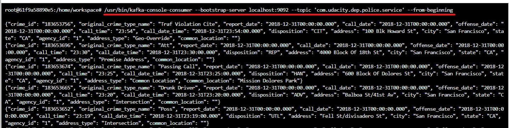
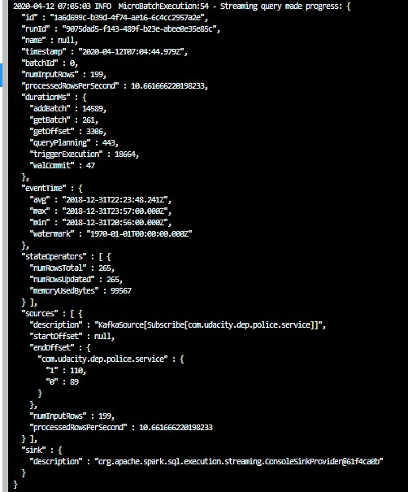

# SPark-Streaming-With-Kafka-Crime

In this project, a real-world dataset, extracted from Kaggle, on San Francisco crime incidents will be used to simulate a real-time streaming dataset. Statistical analyses of the data using Apache Spark Structured Streaming will be implemented. A Kafka server wuill be used to produce data, and ingest data through Spark Structured Streaming.

## Running the Project
Open a new command line window to execute the following codes in order.

1) To start the ZooKeeper Server
Use the following command to start the ZooKeeper Server
```
/usr/bin/zookeeper-server-start config/zookeeper.properties
```
2) To start the Kafka Server
Use the following command to start the Kakfa Server. 
```
/usr/bin/kafka-server-start config/server.properties
```

3) Kafka Producer
Use the following command to start ingesting data into Kafka Server. The data is read from `police-department-calls-for-service.json` and pushed to Kafka Server periodically. 
```
python kafka_server.py
```

4) To run the Consumer Kafka Server
To check whether data had been successfully produced by the Kafka producer, adn correctly implemented the Kafka Producer, run the following command to see the what are the data produced by Kafka producer.

```
kafka-console-consumer --topic "<topic name>" --from-beginning --bootstrap-server localhost:9092
```
In this case, the topic name I have choosen is "com.udacity.dep.police.service", hence, for example, I will run the following command:
```
kafka-console-consumer --topic "com.udacity.dep.police.service" --from-beginning --bootstrap-server localhost:9092
```
The following Output is expected:

Kafka Consumer Output

5) To run the Spark Codes
```
spark-submit --packages org.apache.spark:spark-sql-kafka-0-10_2.11:2.3.4 --master local[*] data_stream.py
```
The following Progress Report is expected:



Progress Report

The following sample Aggregated Output is expected:


Aggregated Output


## Additional Questions


1) How did changing values on the SparkSession property parameters affect the throughput and latency of the data?

`processedRowsPerSecond` could be tweak to give higher throughput. Higher Throughput could be achieved by increasing the value being cofigure in this property parameters. 

2) What were the 2-3 most efficient SparkSession property key/value pairs? Through testing multiple variations on values, how can you tell these were the most optimal?

The most efficient Property key/value pairs are:

<ul>
  <li>spark.default.parallelism</li>
  <li>spark.streaming.kafka.maxRatePerPartition</li>
  <li>spark.sql.shuffle.partitions</li>
</ul> 

These properties setting could be used to maximise `processedRowsPerSecond`, increasing the number of rows that could be processed by the machine. However, this depends on the machine's properties, ie the number cores the machines has, the type of clusters being used etc.
